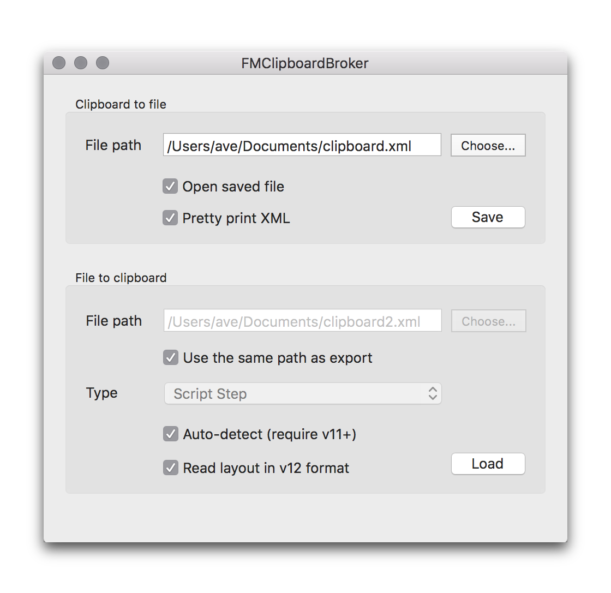

# FMClipboardBroker

FMClipboardBroker saves/loads FileMaker clipboard object to/from XML text file.

Version 1.x was written in AppleScriptObjC and version 2.x here is rewritten in Swift from scratch.  
All the features of version 1.x should be in 2.x as well, so please see the 1.x product page for the details.

- [English](http://www.key-planning.co.jp/software/fmclipboardbroker/fmclipboardbroker-english/)
- [Japanese](http://www.key-planning.co.jp/software/fmclipboardbroker/)

## System requirement

- Version [2.1](https://github.com/harawata/fmclipboardbroker/releases/tag/2.1) requires Mac OS X 10.11 or later (tested on 10.12)
- Version [2.0](https://github.com/harawata/fmclipboardbroker/releases/tag/2.0) requires Mac OS X 10.9 or later (tested on 10.11)

## Download

Download the .dmg from the [latest release page](https://github.com/harawata/fmclipboardbroker/releases/latest).

## Bug report, feature request, question.

Please use the [tracker](https://github.com/harawata/fmclipboardbroker/issues).

## License

Apache License v2.0.

